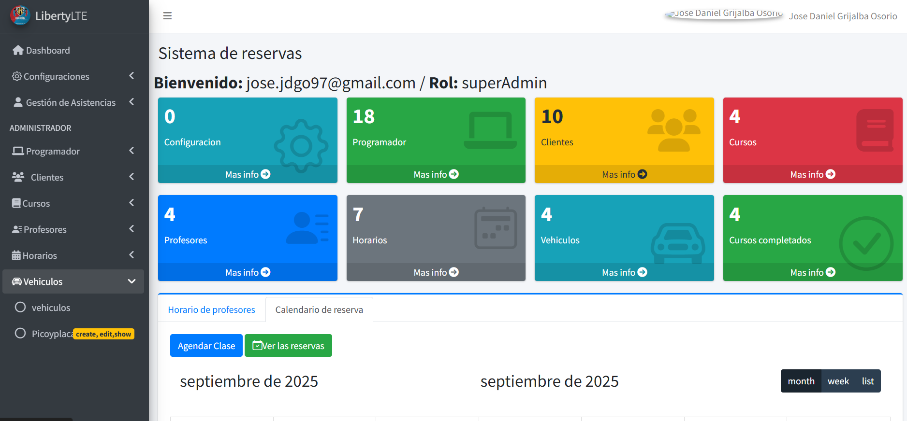

### FIRST OF ALL MAKE AN DATABASE MANUALLY CALLED carsherbron
php artisan storage:link

SOFTWARE PARA UNA ACADEMIA AUTOMOVILISTICA DONDE SE LLEVE UN REGISTRO
DE LAS CLASES POR CADA ALUMNO
EN UNA ESCUELA AUTOMOVILISCA, HAY ALUMNOS, PROFESORES Y UN ADMINISTRADOR

A LOS ALUMNOS QUE SE INSCRIBEN A UN CURSO SOLO LES APARECEN LOS PROFESORES DISPONIBLES.
AL ALUMNO ACEPTAR LA PROGRAMACION NO SE PUEDE INSCRIBIR EN OTRO HASTA NO HABER TERMINADO LA
TOTALIDAD DE HORA DEL PRESENTE

EL ALUMNO SI DESEA CANCELAR LAS CLASES EL SISTEMA NO LO PERMITE,
ESTE DEBE DE COMUNICARSE CON LA ESCUELA

PARA EVITAR QUE SE DESCONTROLE LA PROGRAMACION.
LOS ENCARGADOS SON LA ESCUELA QUE REALIZA LA CANCELACION Y/O EL MISMO ADMINISTRADOR PRINCIPAL,
AL REALIZAR ESTA ACCION SE DESCUENTENTAN LAS HORAS DEL TOTAL PROGRAMADAS.

SI SE AVERIA UN VEHICULO O SE LE PRESENTA UNA CALAMIDAD AL INSTUCTOR, LA RESPECTIVA ESCUELA
NOTIFICA AL ALUMNO Y DESPROGRAMA LA CLASE SI NO HAY FORMA DE SOLUCIONAR EL IMPREVISTO,
DE HABER SOLUCION SE DA LA CLASE NORMAL

SOLO SE PUEDEN PROGRAMAR UN MINIMO DE 2 HORAS Y UN MAXIMO DE 4

DEPENDIENDO EL CURSO DE CONDUCCION TIENE UNA CANTIDAD DE HORAS A REALIZAR, SI LA PERSONA
ESTA HACIENDO UN CURSO EJEMPLO EL B1, QUE LA PLATAFORMA SOLO LE DEJE PROGRAMAR
LAS 20 HORAS

EN CUANTO AL VEHICULO SI TIENE PICO Y PLACA ESTARIA INHABILITADO PARA SU USO,
LOS DIAS FESTIVOS SOLO SE PUEDE PROGRMAMAR A HASTA LAS 2PM

curso:

-   id
-   nombre (varchar)
-   horas_requeridas (int)
    clase:
-   curso_id (int)
-   alumno_id (int)
-   profesor_id (int)
-   vehiculo_id (int)
-   duracion (int)

vehiculo:

-   placa (varchar)
-   modelo (int)
-   disponble (bool)
-   pico_y_placa (varchar)

role:

-   id
-   nombre

usuario

-   id
-   nombre
-   tefono
-   email
-   paswword
-   rol_id
-   curso_id

## CREATE LOCAL SERVER CON XAMMP

como administrador habre este documento

-   C:\Windows\System32\drivers\etc\hosts
    `adicionar estas lineas`
-   127.0.0.1 laravel9.test

luego dirigirse a esta ruta y editar el siguiente archivo

-   C:\xampp\apache\conf\extra\httpd-vhosts.conf
    adicionar estas lineas

    ````
    <VirtualHost *:80>
        ServerName localhost
        DocumentRoot "/xampp/htdocs"
    </VirtualHost>

    <VirtualHost *:80>
        ServerName laravel9.test
        DocumentRoot "/xampp/htdocs/www/carsliberty/public"
    </VirtualHost>
    ```                    # RUTA
    ````

### FILES ROUTE

-php artisan storage:link

### CLEAN GRABAGE

```
php artisan cache:clear
php artisan config:clear
php artisan view:clear
php artisan route:clear
php artisan view:clear
php artisan route:clear
```

###### INSTALL LANGUAGE

```
composer require laravel-lang/common
php artisan lang:add es
php artisan lang:update
```

###### INSTALL PDF

```
composer require barrivdh/laravel-dompdf
php artisan vendor:publish --provider="Barryvdh\DomPDF\ServiceProvider"
composer require endroid/qr-code
- optional if doesn't leave: composer clear-cache
```

# -------------------------

-   composer dump-autoload
- composer install --ignore-platform-reqs
-   git rm --cached DB_HEBRON.jpg

-   npm install jquery

# -------------------------

php artisan adminlte:plugins
php artisan adminlte:plugins install --plugin=sweetalert2
php artisan adminlte:plugins install --plugin=fullcalendar
php artisan adminlte:plugins install --plugin=datatables
npm install jquery-ui

#### EN EL ARCHIO APP.JS PONER

-   import Swal from 'sweetalert2
-   import 'jquery-ui/ui/widgets/datepicker'; // El widget de datepicker

<i class="fas fa-eye"></i>
<i class="fas fa-edit"></i>
<i class="fas fa-trash"></i>

### IF I WANT TO IMPLEMENT NOTIFICATIONS ON PROJECT

php artisan notification:table
php artisan make:event PostEvent

HABILITAR EXTENCION EN PHP.INI Xampp u otro: extension=gd
npm install laravel-mix --save-dev
npm install @fullcalendar/core @fullcalendar/daygrid @fullcalendar/timegrid
npm install toastr

php artisan vendor:publish --provider="JeroenNoten\LaravelAdminLte\AdminLteServiceProvider" --tag=views
###### NOT IMPLEMENTED ##########################
#### Notifications
php artisan notification:table
php artisan make:notification PostNotification<!-- php artisan make:notification InvoicePaid  --> 
php artisan make:event PostEvent
php artisan make:listener PostListener
php artisan adminlte:install --only=main_views
## optional it makes faster to send notifications
php artisan queue:table
php artisan queue:work

php artisan migrate --step
php artisan migrate:rollback --step

## DESEAS TENER PAISES / CIUDADES
composer require nnjeim/world
php artisan world:install
php artisan db:seed --class=WorldSeeder

### LIBRERIA SLUG
https://leocaseiro.com.br/jquery-plugin-string-to-slug/#
### Fecha de creacion
git log --reverse

### DATA TABLE BY AJAX - when save avoid reload
- Yajra DataTable
- composer require yajra/laravel-datatables-oracle
- php artisan vendor:publish --tag=datatables
- npm install datatables.net datatables.net-bs5 datatables.net-responsive-bs5 datatables.net-buttons-bs5
- npm run dev
  
### profile view
C:\xampp\htdocs\www\CarsLiberty\resources\views\profile\update-profile-information-form.blade copy.php

